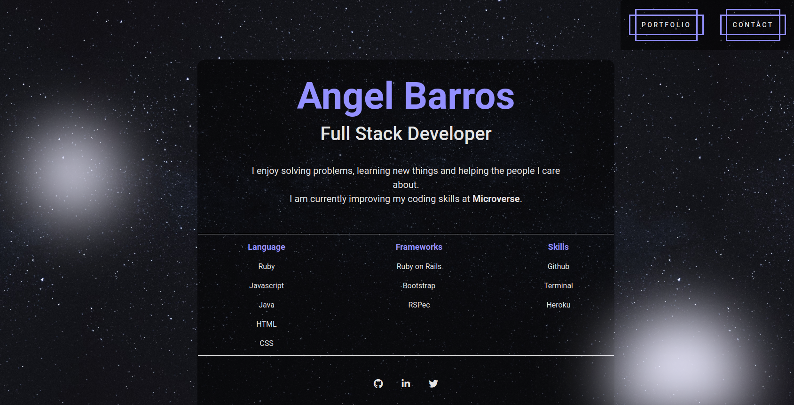

## PERSONAL PORTFOLIO

## Introduction

This is the first version of my personal portfolio.

## Content

It has a main page with a small description, and link to access the portfolio.

Each project has access to a more detailed description and a link to see the source and a liver version if available.

Photo by [Kai Pilger](https://unsplash.com/@kaip?utm_source=unsplash&amp;utm_medium=referral&amp;utm_content=creditCopyText) on [Unsplash](https://unsplash.com/s/photos/night-sky?utm_source=unsplash&amp;utm_medium=referral&amp;utm_content=creditCopyText)

Buttons effects by [Tobias Reich](https://codepen.io/electerious)

## Live Demo

[Live Demo Link](https://zappat0n.github.io/education2020/)

## Designed With
- HTML
- Bootstrap
- SCSS
- Git
- Gitflows
- Webhint
- Styleint
- VS Code

## Contribute to this Project

Contributions, issues, and feature requests are welcome! Start by:

  - Forking the project
  - Cloning the project to your local machine
  - cd into the project directory
  - Run git checkout -b your-branch-name
  - Make your contributions
  - Push your branch up to your forked repository
  - Open a Pull Request with a detailed description of the development branch of the original project for a review

## Authors

👤 **Angel Barros**

- GitHub: [@Zappat0n](https://github.com/Zappat0n)
- LinkedIn: [LinkedIn](https://www.linkedin.com/in/angel-barros/)

## Show your support

Give a ⭐️ if you like this project!
